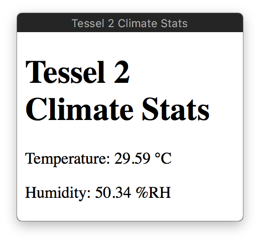
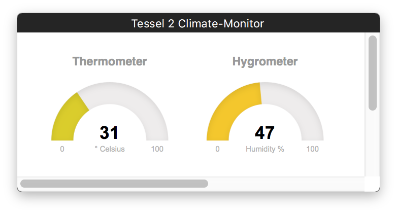

# [Tessel 2][tesselio] Code

http://tessel.github.io/t2-start/

## Blinky

```
t2 run blinky.js
```

A bare bones Tessel 2 blinky script.

## Climate Stats (Temperature, Humidity)

HTML5, Vanilla-JS, WebSockets



```
t2 run climate-ws.js
```

```
t2 push climate-ws.js
```

[tesselio]: https://tessel.io

## Climate Monitor Dashboard (Temperature, Humidity)

HTML5, Vanilla-JS, Express, Socket.io

Inspired by and derived from [Experiment 10: Using the BME280](https://learn.sparkfun.com/tutorials/experiment-guide-for-the-johnny-five-inventors-kit/experiment-10-using-the-bme280) of the *Experiment Guide for the Johnny-Five Inventor's Kit*.



```
t2 run climate-socketio.js
```

```
t2 push climate-socketio.js
```