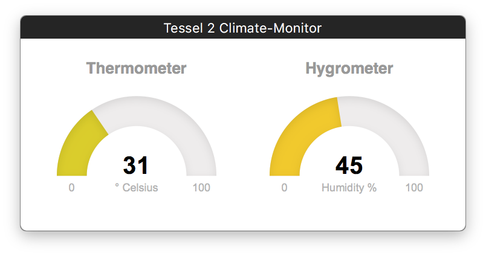

# [Tessel 2][tesselio] Code

## Prerequisites

Tessel currently only supports the Long Term Support (LTS) version of Node.js.

Therefore please make sure you're using Node.js v4.x.x.

## Blinky

[tessel.github.io/t2-start/](http://tessel.github.io/t2-start/)

```
t2 run blinky.js
```

A bare bones Tessel 2 blinky script.

## Climate Stats (Temperature, Humidity)

HTML5, Vanilla-JS, WebSockets


```
t2 run climate-ws.js
```

```
t2 push climate-ws.js
```

[tesselio]: https://tessel.io

## Climate Monitor Dashboard (Temperature, Humidity)

HTML5, Vanilla-JS, Express, Socket.io

Inspired by and derived from [Experiment 10: Using the BME280](https://learn.sparkfun.com/tutorials/experiment-guide-for-the-johnny-five-inventors-kit/experiment-10-using-the-bme280) of the *Experiment Guide for the Johnny-Five Inventor's Kit*.



```
t2 run climate-socketio.js
```

```
t2 push climate-socketio.js
```

## React Climate Monitor Dashboard (Temperature, Humidity)


### React App

Dependencies:

- [A React wrapper for Socket.IO](https://www.npmjs.com/package/react-socket)
- [Simple SVG Gauge component, inspired by JustGage](https://www.npmjs.com/package/react-svg-gauge)

Source dir: `./climate-socketio-react-app/`

### Dev

Prerequisite to switch to latest Node.js v6.x.x.

`cd ./climate-socketio-react-app && npm start`

### Build

Prerequisite to switch to latest Node.js v6.x.x.

`cd ./climate-socketio-react-app && npm run build`

### Deploy (a.k.a push) to Tessel 2

Prerequisite to switch to Long Term Support (LTS) version of Node.js, i.e v4.x.x.

```
t2 run climate-socketio-react.js
```

```
t2 push climate-socketio-react.js
```